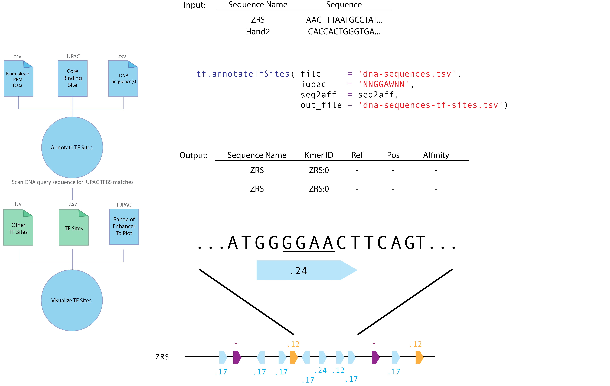

# tfsites.DefineTfSites v1

**Author(s):** Joe Solvason  

**Contact:** Joe Solvason (solvason@eng.ucsd.edu)

**Adapted as a GenePattern Module by:** Ted Liefeld (jliefeld@cloud.ucsd.edu)

**Task Type:** Transciption factor analysis

**LSID:**  urn:lsid:genepattern.org:module.analysis:00441


## Introduction

tfsites.DefineTfSites normalizes PBM data.


## Functionality

TBD

## Methodology

TBD

## Parameters

<span style="color: red;">*</span> indicates required parameter

### Inputs and Outputs

- **input data**<span style="color: red;">*</span>
    - This is a [ state what the format and content is supposed to be] file containing raw PBM data in tsv format.
- **out filename**<span style="color: red;">*</span>
    - Out file name for the annotated PBM data.
- **out graph filename**<span style="color: red;">*</span>
    - Out file name for the graph of normalized affinities.
      
### Other Parameters
- **IUPAC**<span style="color: red;">*</span>
    - IUPAC DNA definition of the transcription factor site .
- **forward column**
    - (1-indexed) Column of the forward DNA sequence in the pbm file.
- **mfi column**
    - (1-indexed) Column of the MFI in the pbm file.
- **header seq**
    - (True/False) s there a header sequence in the raw PBM file?
- **IUPAC 8mers only**
    - (True/False) Only report 8mers abiding by IUPAC in the output.
- **min normalize**
    - (True/False) Normalize with min affinity set to 0.001


## Input Files

1.  input data.  Raw PBM data in tsv format [ define format and contents in detail ] 
    


## Creating Input Files from User Data

TBD Describe how to get common data formats into the format needed here
       
## Output Files

  1.PBM: <output prefix>.pbm.tsv.  Tab-separated text file TBD.
    e.g. 
```
seq     rel_aff
AAAAAAAA        0.147
AAAAAAAC        0.107
AAAAAAAG        0.13
AAAAAAAT        0.125
AAAAAACA        0.123

```
2. PNG: Histogram plots of normalized affinities.

   
    
  
## Example Data

[Example input data is available on github](https://github.com/genepattern/tfsites.defineTfSites/data)
    
## References

Cancer Genome Atlas Network. Comprehensive genomic characterization of head and neck squamous cell carcinomas. Nature. 2015 Jan 29;517(7536):576-82. doi: 10.1038/nature14129. PMID: 25631445; PMCID: PMC4311405.
    
## Version Comments

- **1.0.0** (2023-01-12): Initial draft of document scaffold.
