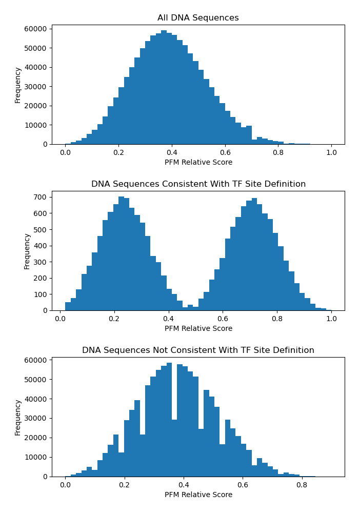

# tfsites.DefineTFBindingSites.from.PFM v1

**Author(s):** Joe Solvason

**Contact:** Joe Solvason (solvason@eng.ucsd.edu)

**Adapted as a GenePattern Module by:** Ted Liefeld (jliefeld@cloud.ucsd.edu)

**Task Type:** Transciption factor analysis

**LSID:**  urn:lsid:genepattern.org:module.analysis:00459


## Introduction

`DefineTFBindingSites.from.PFM` uses the Position Frequency Matrix (PFM) from JASPAR for a transcription factor of interest to score k-mers. The k-mer with the maximum score that conforms to the IUPAC definition of a binding site is normalized to 1.0 and all other k-mers are normalized relative to that score. For example, a normalized value of 0.1 is 10% of the maximum score. 

## Methodology

The raw PFM dataset for a transcription factor is downloaded from [JASPAR](https://jaspar.elixir.no/) and converted to a Position Weight Matrix (PWM). The first step in this conversion is optionally adding pseudocounts to each value in the matrix. If the user does not provide any pseudocounts, then it is automatically calculated. To calculate the pseudocounts for each nucleotide, the sum of all values in the matrix is taken and divided by the number of columns to obtain the average sum of a column in the matrix. Then, this value is used in the following calculation default: (square root of the average sum of a column) * (background frequency of the nucleotide). The resulting pseudocount values can be added to each value in the matrix. If pseudocount values are provided by the user, those values will instead be added to each value in the matrix. Next, each value in the matrix is divided by the value of the average sum of a column in the matrix (previously calculated above for the pseudocounts). Finally, the following calculation is performed for each value in the matrix: log2(value / background frequency of the nucleotide), and this gives us the PWM. 

Next, every possible k-mer is obtained, where k is the length of the binding site definition. The score for every k-mer can be calculated using the PWM. For each nucleotide in the k-mer, obtain the corresponding value contained in the PWM at that position and for that particular nucleotide. Repeat this process for all nucleotides in the k-mer and take the sum of all values to obtain the score.

Lastly, the scores must be normalized. The user defines the minimal binding site using IUPAC nomenclature (ie, N = ATGC, W = AT, [etc](https://genome.ucsc.edu/goldenPath/help/iupac.html)). The tool searches for the k-mer with the highest score that conforms to the IUPAC binding site definition. For all other k-mers, the score will be normalized relative to the score of the maximum k-mer and the resulting value is called the relative score. Therefore, the k-mer with the maximum score will have a relative score of 1.0. The normalization calculation for each k-mer is: relative score = (score) / (score of the maximum IUPAC k-mer). 

## Parameters

<span style="color: red;">*</span> indicates required parameter

### Inputs and Outputs

- <span style="color: red;">*</span> **raw JASPAR PFM (.tsv)** 
    - Position Frequency Matrix from JASPAR. 
- <span style="color: red;">*</span>**reference relative score table output filename (.tsv)**
    - Name of the output file containing the normalized PFM data. 
- <span style="color: red;">*</span>**histograms of relative scores output filename (.png)** 
    - Name of the output graph containing 3 histogram plots of the normalized scores.
      
### Other Parameters
- <span style="color: red;">*</span>**binding site definition (string)**
    - IUPAC definition of the core transcription factor binding site (see [here](https://www.bioinformatics.org/sms/iupac.html)). The length of the binding site definition should be the same as the length of the input PFM. 
- **background frequency of A,C,G,T (comma-separated string)**
    - `Default = [0.25, 0.25, 0.25, 0.25]`
    - Frequencies defining the background model, which contains the probability of each nucleotide being randomly generated. 
- **pseudocount values (comma-separated string)**
    - `Default = auto`
    - Increase each value in the matrix by a certain value to avoid null values. By default, the psuedocounts are calculated as described in the Methodology section above. If the user does not want to use pseudocounts, then this can be specified by setting this value to `0,0,0,0`. 
- **report sites only (boolean)**
    - `Default = False`
    - If `True`, only report k-mers abiding by the binding site definition. If `False`, report all k-mers.
- **enforce minimum relative score (boolean)**
    - `Default = False`
    - If True, enforce the scores to range between 0 and 1. If False, the original range of scores will remain the same.
- **define highest relative score sequence (string)**
    - `Default = None`
    - The k-mer sequence whose score will be used to normalize the scores of all other k-mers. The relative score for this k-mer will be 1.0. 

## Warnings Printed:

1. If there exists another k-mer that conforms to the binding site definition and has a higher score than one provided by the user as **define highest relative score sequence**.
2. If there are any k-mers that do not conform to the binding site definition but have a score greater than the k-mer provided by the user. The affinities of all non-IUPAC kmers with a higher score will be capped at 1.0.

## Input Files

1.  raw JASPAR PFM (.tsv)
- Contains one header line followed by the raw PFM 
```
>MA0098.3	ETS1
A  [  2683    180    425      0      0   2683   2683   1102     89    803 ]
C  [   210   2683   2683     21      0      0      9     21    712    401 ]
G  [   640    297      7   2683   2683      0     31   1580    124   1083 ]
T  [   241     22      0      0     12      0    909     12   1970    396 ]
```
       
## Output Files

1. reference relative score table (.tsv)
- Columns
  - `PFM K-mer:` the sequence of every possible k-mer
  - `PFM Relative Score:` the relative score of the k-mer normalized to the k-mer with the highest score

```
PFM K-mer     PFM Relative Score
AAAATCCAAA    0.34
AAAATCCAAC    0.33
AAAATCCAAG    0.35
AAAATCCAAT    0.33
AAAATCCACA    0.38
```

2. Histograms of Relative Scores (.png) 
- Histogram plots
  - All relative scores
  - Scores for the sequences that follow the TF binding site definition
  - Scores for the sequences that don't follow the TF binding site definition

   
    
  
## Example Data

[Example input data is available on github](https://github.com/genepattern/tfsites.DefineTfSites/data)
    
    
## Version Comments

- **1.0.0** (2023-01-12): Initial draft of document scaffold.
- **1.0.1** (2024-02-02): Draft completed.
